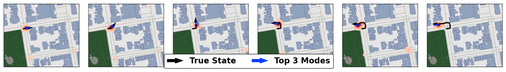

<p align="center">
  <h1 align="center">Learning to be Smooth:<br>An End-to-End Differentiable Particle Smoother</h1>
  <p align="center">
    <a href="https://asyounis.github.io/">Ali&nbsp;Younis</a>
    ·
    <a href="https://ics.uci.edu/~sudderth/">Erik&nbsp;Sudderth</a>
  </p>
  <h2 align="center">Neurips 2024</h2>
  <h3 align="center">
    <a href="tbd">Paper</a> 
    | <a href="https://asyounis.github.io/mdps/">Project Page</a>
    | <a href="https://neurips.cc/virtual/2024/poster/94821">Video</a>
  </h3>
  <div align="center"></div>
</p>
<p align="center">
    <a href="https://asyounis.github.io/mdps/"></a>
    <br>
    <em>Mixture Density Particles Smoother is an end-to-end differentiable particle smoother which uses learned dynamics and measurement models (neural networks), trained end-to-end within the particle smoother algorithm.
</p>

This repository hosts the source code for "Learning to be Smooth: An End-to-End Differentiable Particle Smoother" which introduces Mixture Density Particle Smoothers (MDPS).  MDPS leverages the power of deep learning within a novel end-to-end differentiable particle smoothing algorithm to yield a superior state estimation system that maintains multiple modes in uncertain settings. This repo applies the MDPS to the simple bearings only task as well as the complex task of global localization within city scale environments.


## Installation

This repo requires Python >= 3.10 and [PyTorch](https://pytorch.org/).  We have exported the python environment using "pip3 freeze" and provided it in requirements.txt.

To run the evaluation and training, install the requirements:

```bash
python -m pip install -r requirements.txt
```

## Dataset Download and Preparation

#### Bearings Only
Bearings only dataset is a synthetic dataset that is created when any of the bearings only experiments is run for the first time.  As such please only run 1 bearings only experiment at first and once the dataset is generated and saved it is safe to run multiple bearings only jobs in parallel.

#### Mapillary Geo-Location

#### Kitti


## Training And Evaluation
All experiment configs and run scripts are contained in `./experiments/`. There are sub-directories for each dataset type.  To run an experiment navigate to that experiments directory and execute the run script. Running an experiment will result in training and evaluation of the method. Enabling or disabling training or evaluation (as well as changes to the experiment settings) can be done by editing that experiments `config.yaml` file.
For example, to run the training and evaluation of MDPS for bearings only:
```
cd ./experiments/bearings_only/mdps_strat/
./run.bash
```
**Note:** you must navigate to the directory before using the run script.


#### Bearings Only

Below is a mapping between the name of each method used in the paper and the directory in which the config file and run script are placed.
| Paper Method Name          | Directory Name (in `./experiments/bearings_only`)      |
|----------------------------|--------------------------------------------------------|
| TG-PF (Multinomial)        | mdpf_forward_truncated_gradient_resampling_multinomial |
| TG-PF (Stratified)         | mdpf_forward_truncated_gradient_resampling_stratified  |
| SR-PF (Multinomial)        | mdpf_forward_discrete_soft_resampling_multinomial      |
| SR-PF (Stratified)         | mdpf_forward_discrete_soft_resampling_stratified       |
| MDPF (Multinomial)         | mdpf_forward_multinomial                               |
| MDPF (Stratified)          | mdpf_forward_stratified                                |
| MDPF (Residual)            | mdpf_forward_multinomial                               |
| MDPF-Backward (Stratified) | mdpf_backward_stratified                               |
| FFBS (Multinomial)         | traditional_FFBS                                       |
| MDPS (Stratified)          | mdps_strat                                             |

#### Mapillary Geo-Location

#### Kitti


## Plotting


## BibTex citation
Please consider citing our work if you use any code from this repo or ideas presented in the paper:
```
@inproceedings{younis2024mdps,
      author    = {Younis, Ali and Sudderth, Erik},
      title     = {Learning to be Smooth: An End-to-End Differentiable Particle Smoother},
      booktitle = {Neurips},
      year      = {2024},
}
```